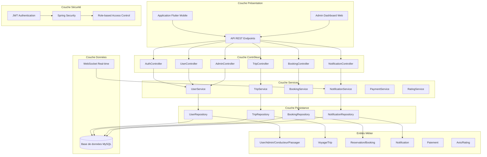

# Architecture Logique - Application Covoiturage

## Vue d'ensemble
L'architecture logique décrit l'organisation des composants logiciels et leurs interactions dans l'application de covoiturage.

## Diagramme d'Architecture Logique

## Description des Couches

### 1. Couche Présentation
- **Application Flutter** : Interface mobile pour conducteurs et passagers
- **Admin Dashboard** : Interface web pour l'administration
- **API REST** : Points d'entrée pour toutes les requêtes

### 2. Couche Contrôleurs
- **AuthController** : Gestion de l'authentification
- **TripController** : Gestion des trajets
- **BookingController** : Gestion des réservations
- **UserController** : Gestion des utilisateurs
- **AdminController** : Fonctionnalités d'administration
- **NotificationController** : Gestion des notifications

### 3. Couche Services
- **UserService** : Logique métier des utilisateurs
- **TripService** : Logique métier des trajets
- **BookingService** : Logique métier des réservations
- **NotificationService** : Gestion des notifications
- **PaymentService** : Gestion des paiements
- **RatingService** : Système d'évaluation

### 4. Couche Sécurité
- **JWT Authentication** : Authentification par tokens
- **Spring Security** : Framework de sécurité
- **Role-based Access Control** : Contrôle d'accès par rôles

### 5. Couche Persistance
- **Repositories** : Accès aux données via JPA
- **Base de données MySQL** : Stockage persistant
- **WebSocket** : Communication temps réel

### 6. Entités Métier
- **User/Admin/Conducteur/Passager** : Types d'utilisateurs
- **Voyage/Trip** : Trajets proposés
- **Reservation/Booking** : Réservations
- **Notification** : Notifications système
- **Paiement** : Transactions financières
- **Avis/Rating** : Système d'évaluation

