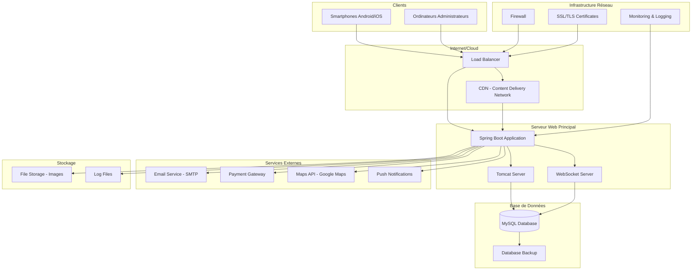

# Architecture Physique - Application Covoiturage

## Vue d'ensemble
L'architecture physique décrit le déploiement concret de l'application sur des serveurs, machines et infrastructures matérielles.

## Diagramme d'Architecture Physique



## Description des Composants Physiques

### 1. Couche Client
- **Smartphones** : Appareils mobiles avec application Flutter
- **Ordinateurs** : Stations de travail pour administrateurs

### 2. Infrastructure Réseau
- **Load Balancer** : Répartition de charge pour haute disponibilité
- **CDN** : Distribution de contenu statique
- **Firewall** : Protection réseau
- **SSL/TLS** : Chiffrement des communications

### 3. Serveur d'Application
- **Spring Boot Application** : Application principale (Port 8081)
- **Tomcat Server** : Serveur web intégré
- **WebSocket Server** : Communication temps réel

### 4. Base de Données
- **MySQL Database** : Base de données principale
- **Database Backup** : Sauvegarde automatique

### 5. Services Externes
- **Email Service** : Envoi d'emails (SMTP Gmail)
- **Payment Gateway** : Traitement des paiements
- **Maps API** : Services de géolocalisation
- **Push Notifications** : Notifications mobiles

### 6. Stockage et Monitoring
- **File Storage** : Stockage des images utilisateurs
- **Log Files** : Journaux d'application
- **Monitoring** : Surveillance système

## Configuration Serveur

### Spécifications Recommandées
- **CPU** : 4 cœurs minimum
- **RAM** : 8GB minimum
- **Stockage** : 100GB SSD
- **Réseau** : 1Gbps

### Ports Utilisés
- **8081** : Application Spring Boot
- **3306** : MySQL Database
- **80/443** : HTTP/HTTPS
- **WebSocket** : Port 8081 (même que l'application)

### Variables d'Environnement
```properties
# Base de données
spring.datasource.url=jdbc:mysql://localhost:3306/covoiturage_final_db
spring.datasource.username=root
spring.datasource.password=

# JWT
app.jwtSecret=your-secret-key-here
app.jwtExpirationMs=86400000

# Email
spring.mail.host=smtp.gmail.com
spring.mail.port=587
spring.mail.username=${EMAIL_USERNAME}
spring.mail.password=${EMAIL_PASSWORD}
```

## Déploiement

### Environnement de Développement
- **Local** : Développement sur machine locale
- **Base de données** : MySQL local
- **Application** : Spring Boot sur port 8081

### Environnement de Production
- **Serveur** : Serveur dédié ou cloud
- **Base de données** : MySQL avec réplication
- **Monitoring** : Surveillance continue
- **Backup** : Sauvegarde automatique quotidienne


